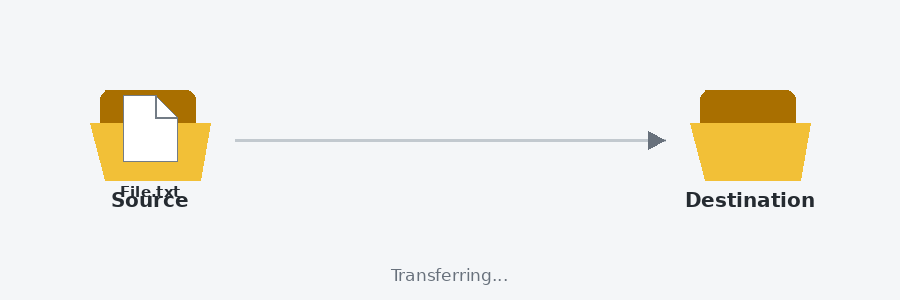

# WinCC Unified Animated File Transfer

Custom Web Control for WinCC Unified that animates one file from a source folder to a destination folder.

## Version 1.1.0

### Properties
- `Start` (Boolean): request from WinCC/PLC. A rising TRUE starts one animation.
- `End` (Boolean): acknowledge generated by the CWC when the file reaches destination.
- `AnimationTime` (Number): animation duration in milliseconds. Minimum 100 ms.
- `SourceFolderName` (String): source folder label.
- `DestinationFolderName` (String): destination folder label.
- `FileName` (String): animated file label.

### Handshake
1. Initial state: `Start = FALSE`, `End = FALSE`.
2. PLC/WinCC sets `Start = TRUE`.
3. The file moves from source to destination.
4. At destination the file remains visible and the CWC sets `End = TRUE`.
5. WinCC detects `End = TRUE` and sets `Start = FALSE`.
6. The CWC returns the file to source and sets `End = FALSE`.

`webcc.min.js` is the Siemens WebCC runtime library used by the reference WinCC Unified template.

## Visual animation

The animation above reproduces the visual behavior of the Custom Web Control:

`Source → File transfer → Destination → End = TRUE → Reset`

## Development

This project was developed with the support of ChatGPT by OpenAI, used as an assistance tool for code development, review, documentation, and troubleshooting.
